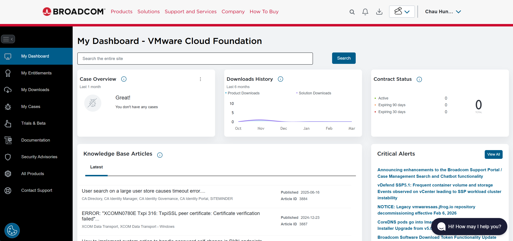
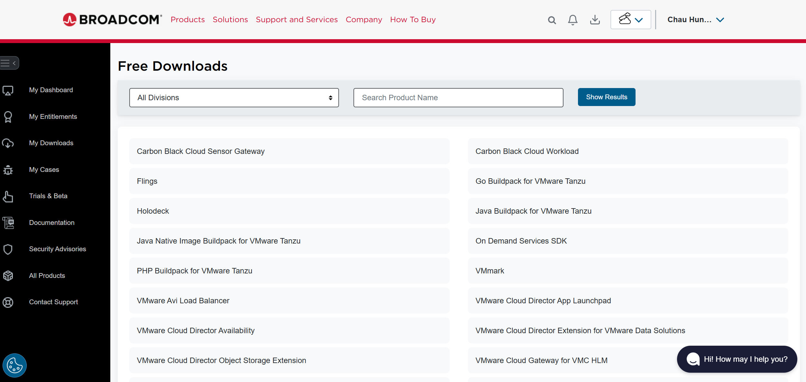
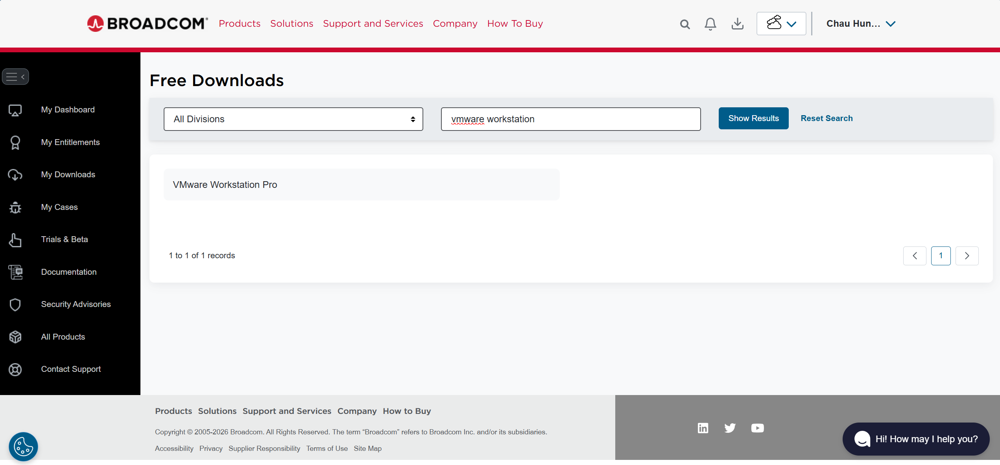
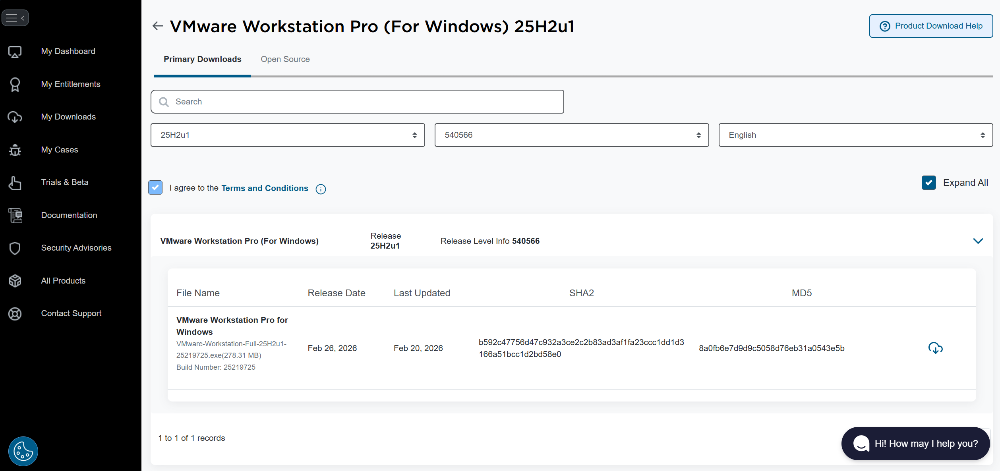
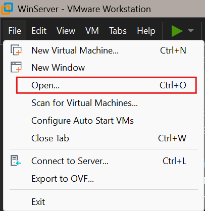
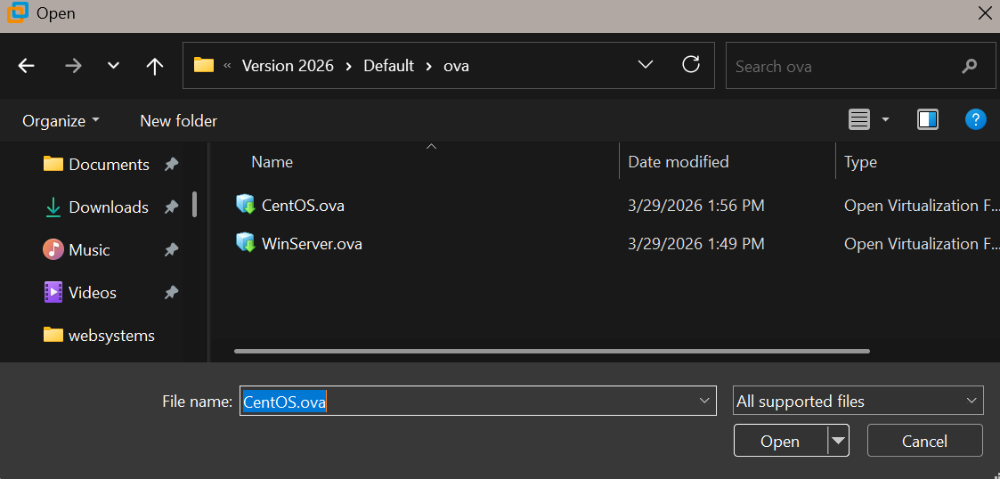
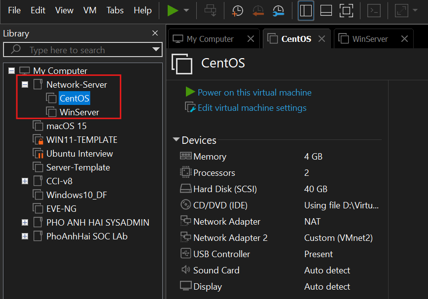
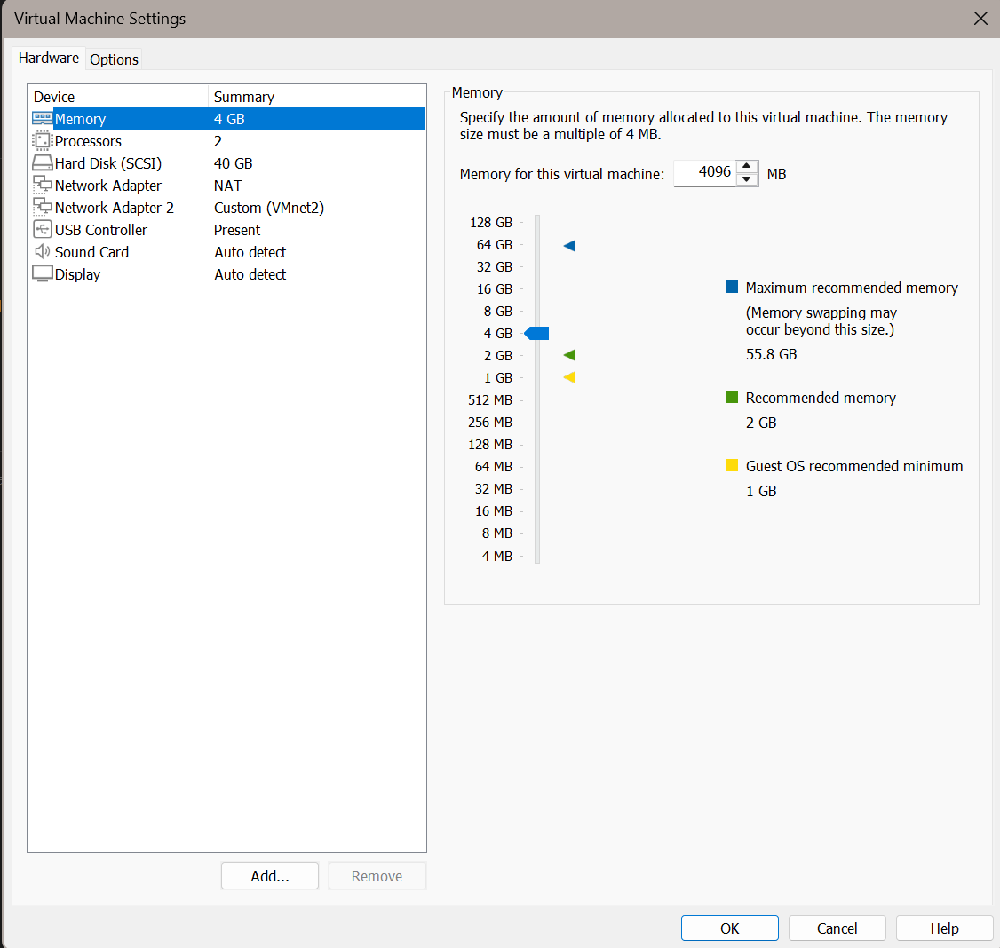
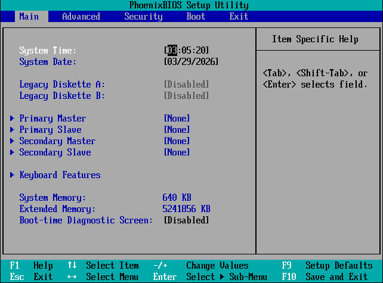
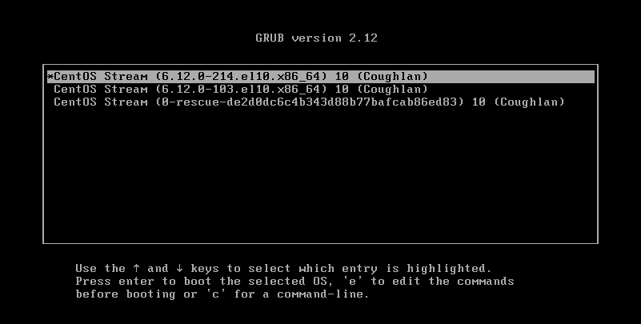

# 🖥️ Lab 1a — VMware Lab Familiarisation

> **Lab Tutorial** — Install VMware, import your CentOS and Windows Server VMs, then explore the environment for the first time.

← [Back to Lab 1](./README.md)

---

## Aims

1. To explore the VMware software
2. To be able to start and shutdown your image running under VMware

---

## Lab Setup — Install VMware & Download VM Images

### Step 1 — Check system requirements

Your host machine needs at least **8GB RAM** (16GB recommended) — VMware needs memory alongside your host OS.

> Skip this step if you are using a lab machine.

---

### Step 2 — Download VMware Workstation Pro

Go to the [Broadcom website]([https://www.broadcom.com](https://support.broadcom.com/group/ecx/my-dashboard)) to download VMware Workstation Pro.

> ⚠️ The UTS software portal no longer hosts this download.

> 📸 *Screenshot — Broadcom download page*
> 

---

### Step 3 — Register a Broadcom account and find the download

Log in to the Broadcom dashboard:

1. Click **My Downloads**
2. Choose **VMware Cloud Foundation**

> 📸 *Screenshot — Broadcom My Downloads dashboard*
> 

---

### Step 4 — Search for VMware Workstation Pro

Search for `VMware Workstation` in the search bar and click **VMware Workstation Pro** from the results.

> 📸 *Screenshot — VMware Workstation Pro search result*
> 

---

### Step 5 — Select your platform and accept T&Cs

Choose **VMware Workstation Pro for Personal Use (Windows)** if you are on a Windows laptop or PC.

Tick the **Terms & Conditions** checkbox to enable the download button at the bottom right, then click the download icon.

> 📸 *Screenshot — T&C checkbox and download button*
> 

---

### Step 6 — Import the `.ova` file into VMware

1. Open VMware Workstation Pro
2. Click **Open a Virtual Machine**
3. Navigate to your `.ova` file (CentOS or Windows Server) and select it
4. Provide a **name** and **storage path** for the new VM
5. Click **Import**

> ✅ You only ever need to import each image **once**.

Storage path examples:

```
/class/NetServers/home/nnnnnnnn/centos64   ← LAN lab machines only
/media/XYZ/centos64                        ← USB hard disk (XYZ = disk label)
```

> 📸 *Screenshot — VMware Open a Virtual Machine dialog*
> 

> 📸 *Screenshot — Import Virtual Machine — name and storage path*
> 

---

### Step 7 — Log in to the VMs

Once imported, power on the VM and log in:

```
username: root
password: student123!
```

> ⚠️ Never use a trivial password like this in production. These are disposable lab VMs only.

---

## Task 1: Navigate through the VMware Lab

On your lab workstation, open VMware Player:

- **Linux lab machine:** Applications → System Tools → VMplayer
- **Windows:** Launch VMware Workstation Pro from the Start menu

From VMware Player/Workstation, click **Open a Virtual Machine** → select `CentOS.ova` or `WindowsServer.ova` → provide the VM name and storage path → click **Import**.

> 📸 *Screenshot — VMware Player home screen showing both VMs imported*
> 

---

### Exploring VM settings

Before starting the VM, select it and click **Edit virtual machine settings**.

Look through the device list and note the following for each device:

- What is it?
- What are its current settings?
- What could you change and why would you?

> 📸 *Screenshot — VM Settings panel showing device list*
> 

📓 **Journal:** Record the full hardware configuration of your CentOS VM:

| Device | Value |
| --- | --- |
| Memory (RAM) | |
| Processors | |
| Hard Disk | |
| CD/DVD | |
| Network Adapter | |
| Network Adapter 2 | |
| USB Controller | |
| Display | |

> In real organisations, hardware configuration is recorded via an enterprise configuration manager, a formal database, or spreadsheets. Many still use paper. We use a Learning Journal.

---

### Starting the CentOS VM

Click **Power on this virtual machine**.

> To get mouse/keyboard access inside the VM window, click inside it.  
> To return to your host desktop, press **Ctrl+Alt**.

---

### Boot sequence observations

Observe and document each stage of the boot:

**Stage 1 — BIOS startup**

The BIOS screen flashes up quickly on screen.

> Optional: Press **F2** as soon as the boot logo appears to enter the BIOS setup screen. You can examine settings such as time/date and boot sequence.

> 📸 *Screenshot — BIOS startup screen*
> 

---

**Stage 2 — GRUB boot loader**

The GRUB screen appears. You can let it boot automatically, or press any key quickly to see the GRUB menu.

> Optional: Press **Enter** quickly when the GRUB screen appears to get the GRUB menu. What boot parameters can you see in the Linux configuration?

> 📸 *Screenshot — GRUB boot loader screen*
> 

---

**Stage 3 — Boot progress bar**

A progress bar appears at the bottom of the screen. Press **ESC** to see the detailed startup sequence — each service and process as it starts.

> 📸 *Screenshot — Boot progress bar (or detailed boot log with ESC pressed)*
> 

---

## Task 2: Log in as Root and Explore

At the login screen, enter:

```
Username: root
Password: student123!
```

> 📸 *Screenshot — CentOS login screen*
> 

---

You may be taken through the **GNOME initial setup** — language, keyboard, location services, and online accounts.

> ⚠️ Do **not** connect any online or social media accounts.  
> At each step, press the blue **Next** or grey **Skip** button at the top right of the window.

> 📸 *Screenshot — GNOME initial setup screen*
> 

---

### Open a terminal

Go to **Activities** (top-left) → choose the icon that looks like a grey command window (terminal).

> 📸 *Screenshot — Activities menu with terminal icon highlighted*
> 

---

### Check the network with ifconfig

```bash
ifconfig
```

> 📸 *Screenshot — Terminal showing ifconfig output*
> 

📓 **Journal:** What do you see? Record all interface names and their IP addresses. Can you identify the default TCP/IP address?

---

### Explore the filesystem

```bash
ls
ls /
ls /etc
```

> 📸 *Screenshot — Terminal showing ls output*
> 

📓 **Journal:** What directories and files do you see? Try to recall Unix commands from Web Systems or Unix Systems Programming.

---

### Switch to superuser with su

Logging on directly as root is extremely rare in practice. We only do it here because these are disposable lab VMs. In real life:

- Root has full system control — one wrong command can easily cripple or destroy your installation
- Best practice: log in as a regular user and use `sudo` for privileged commands
- Alternative: log in as yourself and switch to root using `su`

Switch to superuser:

```bash
su
```

Enter the root password when prompted. Notice the prompt changes from `$` to `#` — this confirms superuser privileges are active.

> 📸 *Screenshot — Terminal showing prompt change from $ to # after su*
> 

---

## Task 3: Reboot and Shutdown

### Reboot the VM

```bash
reboot
```

Observe the screen carefully during the shutdown and reboot sequence.

> 📸 *Screenshot — Shutdown/reboot messages scrolling on screen*
> 

📓 **Journal question:** Why would a system administrator **not** normally just reboot a running production server?

---

### Shutdown the VM

Once the VM has rebooted and you are logged back in, shut it down:

```bash
shutdown -h now
```

Observe and document what happens on screen.

> 📸 *Screenshot — Shutdown messages on screen*
> 

📓 **Journal question:** Why is it important to know how to shut down from the command line, even when GUI menus are available?

> Note: Your Linux distribution also lets you shut down via the GUI — click the power icon near the top right of the screen.

> 📸 *Screenshot — GUI power/shutdown menu*
> 

---

## If you move to another machine

If you take your USB/SSD to a different workstation:

1. Open VMware Player
2. Go to **File → Open**
3. Navigate to your USB hard disk directory
4. Select the `.vmx` file for your VM (normally there is only one)

You will see the startup panel showing the state, OS, version, and RAM.

---

## 💡 Tips

| Tip | Details |
| --- | --- |
| Release mouse/keyboard from VM | Press `Ctrl+Alt` |
| Enter BIOS setup | Press `F2` immediately when the boot logo appears |
| See GRUB menu | Press any key quickly when the GRUB screen appears |
| See detailed boot log | Press `ESC` during the boot progress bar |
| Suspend VM (save state) | VMware menu: **VM → Power → Suspend** — saves to `*.vmem` and `*.vmss` |

---

## 💡 Command Reference

| Command | What it does |
| --- | --- |
| `ifconfig` | Show network interface configuration and IP addresses |
| `ls` | List files and directories in current location |
| `ls /` | List the root filesystem |
| `su` | Switch to superuser (root) — prompt changes to `#` |
| `reboot` | Reboot the system immediately |
| `shutdown -h now` | Halt and power off the system immediately |

---

*Lab 1a · VMware Lab Familiarisation*
